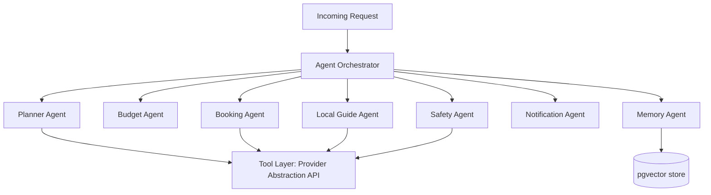

# AI Agent Architecture

> **Status:** Draft
> **Purpose:** Design for the multi-agent AI layer: Planner, Booking, Budget, Safety, Local Guide, Notification, Memory agents.

## Design Principle

Each agent is a **narrow, independently testable component** with a defined input/output contract and a defined set of tools it's allowed to call. Agents do not call external providers directly — they call back into the Core Backend's Provider Abstraction Layer over an internal API. This keeps provider credentials, rate limiting, and error handling in one place (see `06-architecture/provider-abstraction-layer.md`), and lets each agent's prompts/logic evolve without touching provider integration code.

An **Agent Orchestrator** sits above individual agents and is responsible for routing a user or system request to the correct agent(s), sequencing multi-agent workflows, and aggregating results before returning to the Core Backend.



## Agent Catalog Summary

Full responsibilities and interfaces are tracked in `11-ai-ml/agent-catalog.md`. This document covers the architectural pattern shared by all agents.

| Agent | MVP Status | Primary Responsibility |
|---|---|---|
| Planner Agent | **Implemented in MVP** | Converts natural-language trip requests into candidate itineraries |
| Budget Agent | **Implemented in MVP** | Validates itinerary cost against stated budget; tracks running spend |
| Notification Agent | **Implemented in MVP (minimal)** | Dispatches booking confirmations and flight status alerts |
| Booking Agent | Architected, not implemented | Will own transactional booking execution logic currently in Booking Service; extracted into its own agent once booking logic needs AI-driven decisions (e.g., auto-rebooking) |
| Safety Agent | Architected, not implemented | Travel advisories, real-time risk alerts — pending a reliable data source decision |
| Local Guide Agent | Architected, not implemented | In-trip recommendations (food, activities, local tips) |
| Memory Agent | Architected, not implemented | Cross-trip personalization via embeddings in pgvector |

## Common Agent Contract

Every agent, regardless of specialization, implements the same shape:

```python
class Agent(Protocol):
    name: str
    allowed_tools: list[str]  # explicit allowlist, not implicit access to all tools

    async def handle(self, request: AgentRequest) -> AgentResponse:
        ...

class AgentRequest(BaseModel):
    session_id: str
    user_id: str
    input: str | dict
    context: dict  # prior conversation turns, relevant trip state

class AgentResponse(BaseModel):
    output: dict
    tool_calls: list[ToolCall]     # audit trail of what was called
    confidence: float | None
    requires_confirmation: bool     # true for anything booking/payment-affecting
```

**`requires_confirmation`** is a deliberate guardrail: any agent output that would result in a booking, payment, or cancellation is flagged for explicit user confirmation before execution — no agent can autonomously spend user money in MVP. See `11-ai-ml/ai-safety-and-guardrails.md`.

## Tool Layer

Agents access external capability only through a defined, allowlisted **Tool Layer** — thin wrappers around the Provider Abstraction Layer's internal API (flight/hotel search, maps lookup) and internal services (budget calculation, user profile read). Agents cannot make arbitrary HTTP calls or access the database directly; every tool call is logged for auditability (`tool_calls` in `AgentResponse`).

## Orchestration Pattern (MVP)

MVP uses a **sequential orchestration** pattern for the planning flow:
1. Orchestrator receives request → routes to Planner Agent.
2. Planner Agent proposes itinerary → Orchestrator routes result to Budget Agent for validation.
3. If Budget Agent rejects (over budget), Orchestrator re-invokes Planner Agent with the constraint, up to a retry limit, before surfacing a "couldn't fit budget" response to the user.
4. Approved itinerary is returned to the Core Backend for user confirmation.

More complex orchestration (parallel agent calls, conditional branching for Safety Agent alerts, etc.) is deferred to Phase 2 and does not require changes to the Orchestrator's external contract — only its internal routing logic.

## Model Selection

Not fixed in this document — see `11-ai-ml/model-selection-and-evaluation.md` for the evaluation criteria and current model choice per agent. Architecturally, model choice is a per-agent configuration value, not hard-coded, so models can be swapped or mixed (e.g., a smaller/cheaper model for the Budget Agent's arithmetic-heavy validation, a stronger model for the Planner Agent's reasoning).

## Related Documents

- `11-ai-ml/agent-catalog.md`
- `11-ai-ml/ai-safety-and-guardrails.md`
- `11-ai-ml/model-selection-and-evaluation.md`
- `06-architecture/provider-abstraction-layer.md`
- `06-architecture/system-architecture-overview.md`
