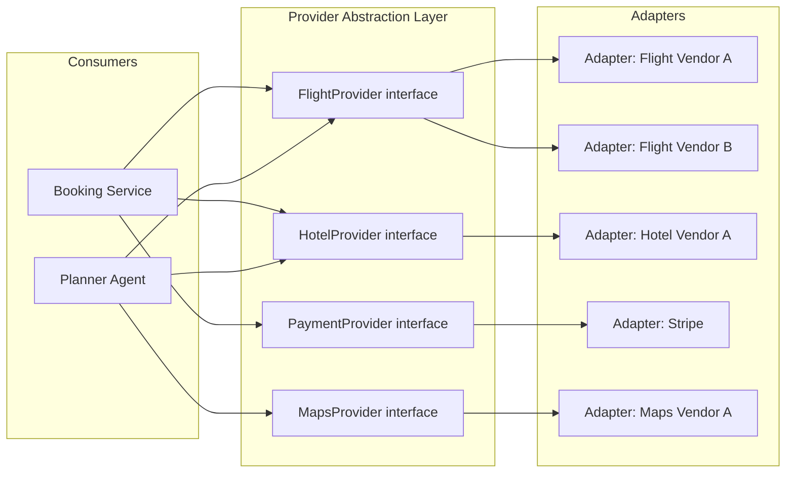

# Provider Abstraction Layer

> **Status:** Draft
> **Purpose:** Design for pluggable flight/hotel/bus/rail/maps/weather/payment providers.

## Problem

Easy Trip must integrate flight, hotel, bus, rail, maps, weather, payment, and notification providers today and in the future, without requiring a refactor each time a provider is added, replaced, or run alongside another for redundancy/price comparison.

## Design Principle

Every external provider category is represented as an **interface** in the Core Backend (NestJS). Concrete providers implement that interface as a **provider adapter**. No other part of the system depends on a specific provider's SDK, request/response shape, or auth mechanism — only on the interface.



## Interface Contract (Example: FlightProvider)

Every provider category defines a normalized request/response contract, independent of any single vendor's API shape.

```typescript
interface FlightSearchRequest {
  origin: string;          // IATA code
  destination: string;     // IATA code
  departDate: string;      // ISO 8601 date
  returnDate?: string;     // ISO 8601 date, omitted for one-way
  travelers: number;
  cabinClass?: 'economy' | 'premium_economy' | 'business' | 'first';
}

interface FlightOption {
  providerId: string;      // which adapter returned this
  price: Money;
  currency: string;
  legs: FlightLeg[];
  bookingToken: string;    // opaque token used at booking time
  expiresAt: string;       // quote validity window
}

interface FlightProvider {
  search(req: FlightSearchRequest): Promise<FlightOption[]>;
  hold(bookingToken: string): Promise<HoldConfirmation>;
  confirm(holdId: string, paymentRef: string): Promise<BookingConfirmation>;
  cancel(bookingId: string): Promise<CancellationResult>;
}
```

Every category (Hotel, Bus, Rail, Maps, Weather, Payment, Notification) follows the same pattern: a normalized domain model + a small set of lifecycle methods (`search`/`hold`/`confirm`/`cancel` for bookable categories; `get`/`query` for informational categories like Maps/Weather).

## Adding a New Provider

Adding a new flight vendor, for example, means:
1. Implement `FlightProvider` for that vendor (new adapter class, isolated to its own module/file).
2. Register it in the provider registry with a routing rule (e.g., "try Vendor A first, fall back to Vendor B on error/no-results", or "query all and merge/rank").
3. No changes required in Booking Service, Planner Agent, or any consumer of the `FlightProvider` interface.

## Multi-Provider Routing Strategies (configurable per category)

- **Waterfall:** try providers in priority order, stop at first success.
- **Fan-out + merge:** query all registered providers in parallel, merge and de-duplicate results, rank by price/fit.
- **Region-based:** route by traveler origin/destination region to the provider with best regional coverage.

MVP uses waterfall (single provider) per category, per `03-product/mvp-scope.md`; fan-out is the anticipated Phase 2 upgrade path and requires no interface changes, only registry configuration.

## Error Handling & Resilience

- Every adapter must translate provider-specific errors into a normalized `ProviderError` (categories: `RATE_LIMITED`, `NO_AVAILABILITY`, `INVALID_REQUEST`, `PROVIDER_DOWN`, `TIMEOUT`).
- Booking Service treats `PROVIDER_DOWN`/`TIMEOUT` as retryable (with backoff) up to a configured limit, then surfaces a user-facing "try again" state rather than a raw error.
- Circuit breaker per adapter to avoid cascading failures when a provider is degraded (implementation detail for the eventual code phase; documented here as a requirement).

## Credentials & Security

- Provider credentials live only inside their adapter's configuration, sourced from the secrets manager (`07-security/secrets-management.md`), never hard-coded or accessible to consumers of the interface.

## Related Documents

- `06-architecture/system-architecture-overview.md`
- `06-architecture/integration-architecture.md`
- `07-security/secrets-management.md`
- `03-product/mvp-scope.md`
