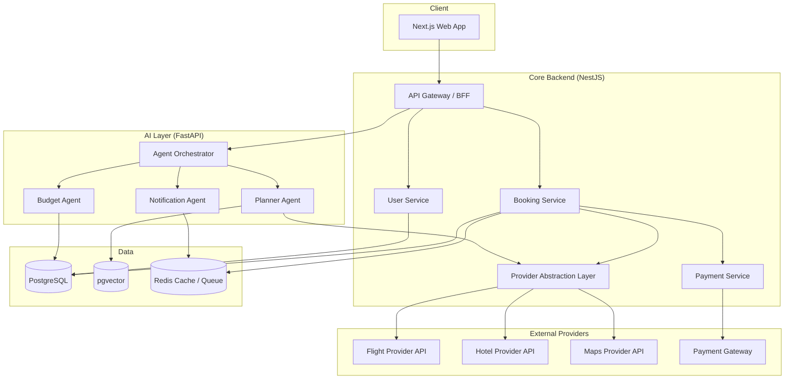

# System Architecture Overview

> **Status:** Draft
> **Purpose:** High-level architecture: services, data flow, and how components interact.

## High-Level Diagram

## Components

### Client
- **Next.js Web App** — the only client in MVP. Talks exclusively to the Core Backend's API Gateway (never directly to the AI layer or external providers).

### Core Backend (NestJS)
- **API Gateway / BFF (Backend-for-Frontend)** — single entry point for the web app; composes calls to Booking, User, and AI Orchestrator services. Owns request validation, auth, and rate limiting.
- **Booking Service** — owns the booking lifecycle (search → hold → confirm → post-booking state), idempotency, and transactional integrity across providers.
- **User Service** — accounts, profiles, saved travelers, auth.
- **Provider Abstraction Layer** — see `06-architecture/provider-abstraction-layer.md`. All external provider calls (flights, hotels, maps, payments) go through this layer; no service calls a provider SDK directly.
- **Payment Service** — wraps the payment gateway behind the same abstraction principle as other providers, isolating PCI-relevant code into one auditable boundary.

### AI Layer (FastAPI, separate service)
- **Agent Orchestrator** — routes requests to the correct agent(s), manages multi-agent workflows (e.g., Planner Agent proposing an itinerary, then Budget Agent validating it against stated budget before returning to the user).
- **Planner Agent, Budget Agent, Notification Agent** — see `11-ai-ml/agent-catalog.md` for full responsibilities. Additional agents (Booking, Safety, Local Guide, Memory) are architected for but not implemented in MVP.
- The AI layer calls back into the Core Backend's Provider Abstraction Layer for live pricing/availability — it does not call external provider APIs directly, keeping provider credentials and logic in one place.

### Data Layer
- **PostgreSQL** — system of record for users, bookings, payments, trip state.
- **pgvector** — embeddings for the (future) Memory Agent and any semantic search features; isolated behind a data-access interface so it can be migrated to a dedicated vector store without touching business logic.
- **Redis** — caching (provider search results, session data) and queues (BullMQ) for async work: notification dispatch, booking confirmation workflows.

## Request Flow Example: "Plan a trip to Goa under $800"

1. Web app sends the natural-language request to API Gateway.
2. API Gateway forwards to the AI Layer's Agent Orchestrator.
3. Orchestrator invokes the Planner Agent, which calls back into the Core Backend's Provider Abstraction Layer (via an internal service-to-service API) to get live flight/hotel options.
4. Planner Agent assembles candidate itineraries; Budget Agent validates each against the $800 ceiling.
5. Orchestrator returns ranked itinerary options to API Gateway, which returns them to the web app.
6. On user confirmation, API Gateway calls the Booking Service, which executes the booking transaction across flight and hotel providers (via the abstraction layer) and the Payment Service.
7. Booking Service persists the confirmed booking to PostgreSQL and enqueues a confirmation notification job in Redis/BullMQ, picked up by the Notification Agent.

## Service-to-Service Communication

- Core Backend ↔ AI Layer: internal REST over a private network, authenticated via service tokens (see `07-security/auth-and-access-control.md`, to be updated with the specific mechanism).
- All external provider calls are synchronous only from the Provider Abstraction Layer; nothing else in the system holds provider credentials.

## Non-Goals of This Document

This document describes structure, not deployment topology (see `08-devops/infrastructure-overview.md`) or the internal design of the provider abstraction layer or AI agents (see their dedicated documents).

## Related Documents

- `06-architecture/tech-stack-decision.md`
- `06-architecture/provider-abstraction-layer.md`
- `06-architecture/ai-agent-architecture.md`
- `06-architecture/data-architecture.md`
- `08-devops/infrastructure-overview.md`
